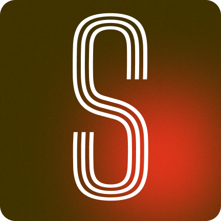
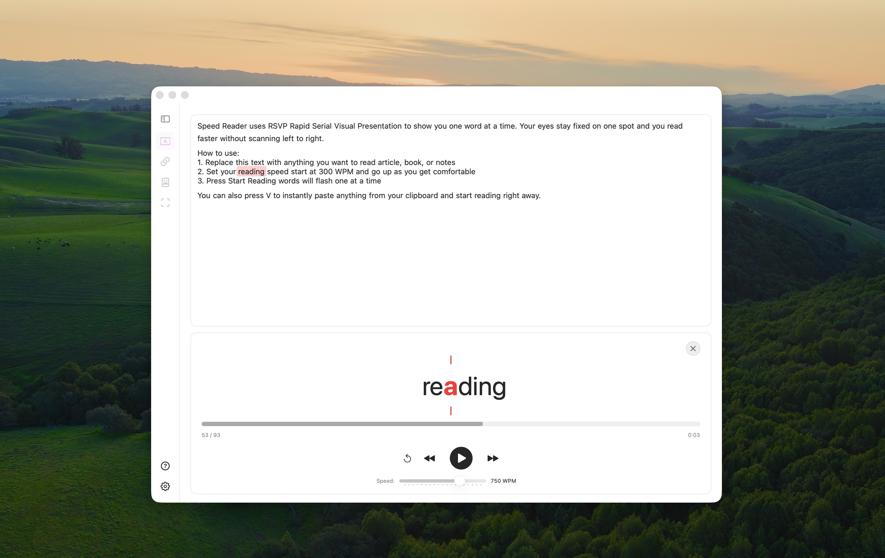
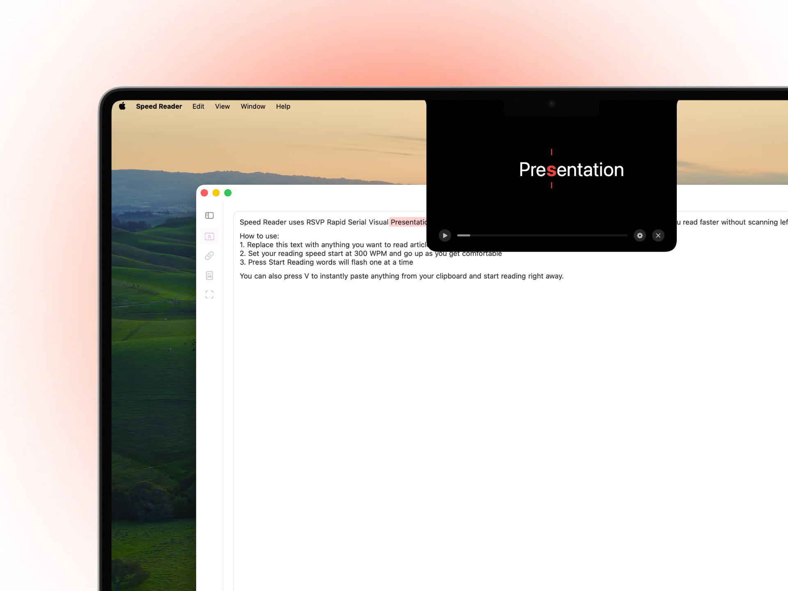
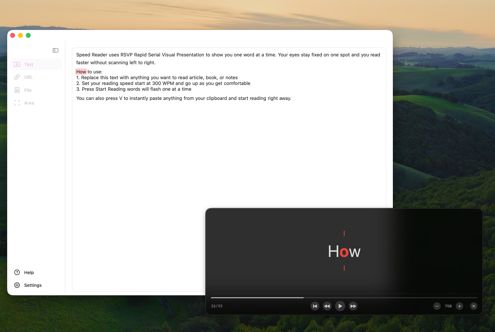
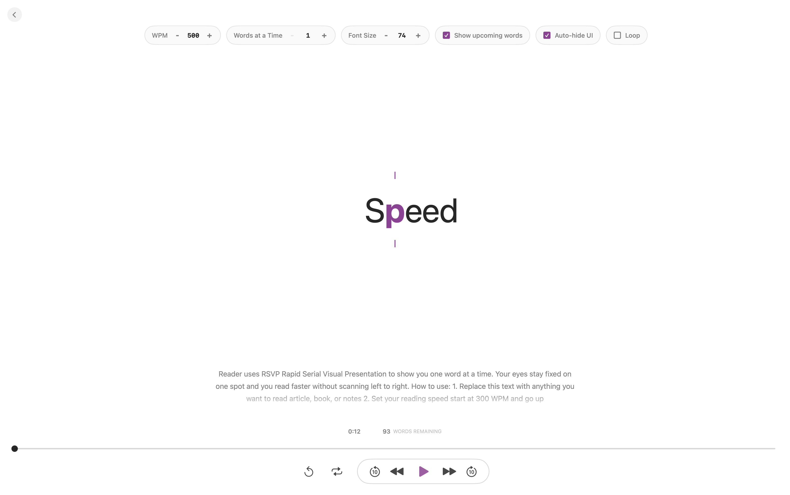

<div align="center">
  

  # Speed Reader

  **Read 2–5× faster on macOS with zero effort.**

  Speed Reader uses RSVP to show text one word at a time at your pace.<br>
  Articles, books, PDFs — anywhere on your Mac.

  macOS 14+ · Swift 5.9 · [MIT](LICENSE) · No telemetry
</div>

<br>

<div align="center">
  
</div>

## Why Speed Reader?

Traditional reading spends time moving your eyes across each line. **Rapid Serial Visual Presentation (RSVP)** keeps words in one fixed position, while **Optimal Recognition Point (ORP)** highlighting guides your eye to the most useful letter.

Speed Reader is a native SwiftUI app: fast, lightweight, and built for macOS. No Electron, account, trial, paywall, analytics, or crash-reporting service.

## Everything you need to read faster

- **100–1000 WPM** — adjust speed live with buttons or keyboard shortcuts.
- **ORP highlighting** — keep eye fixation stable as words change.
- **Multi-format reading** — PDF, EPUB, DOCX, Markdown, FB2, TXT, and images.
- **Built-in OCR** — read scanned PDFs, images, or any selected screen area using Apple Vision.
- **Clean URL extraction** — paste an article link and remove navigation, ads, and clutter.
- **Smart pauses** — stop automatically on images, formulas, tables, and code blocks.
- **Search and table of contents** — navigate long documents without losing your place.
- **Local reading history** — continue recent files and URLs, view streaks, WPM, and time saved.
- **Menu bar access** — start from clipboard, file, URL, or screen capture without changing workflow.
- **Custom appearance** — fonts, colors, themes, reader sizes, and per-mode controls.

## Four ways to read

| Main Window | Notch Widget |
|:--:|:--:|
|  |  |
| Preview text, highlight the current word, and control playback in one place. | Keep a minimal Dynamic Island-style reader around the MacBook notch. |

| Separate Window | Zen Mode |
|:--:|:--:|
|  |  |
| Read beside other apps in an adjustable floating glass panel. | Enter a distraction-free fullscreen reader with context, scrubbing, and chunked words. |

## Read anything

| Input | Support |
|---|---|
| Documents | PDF, EPUB, DOCX, Markdown, FB2, TXT |
| Images | JPEG, PNG, TIFF, HEIC, BMP via OCR |
| Web | Article URLs with clean text extraction |
| Screen | Native area capture with Vision OCR |
| Clipboard | One-click reading from the menu bar |

## Keyboard shortcuts

| Shortcut | Action |
|---|---|
| `⌘⏎` | Start reading |
| `Space` | Play or pause |
| `←` / `→` | Previous or next word |
| `⇧←` / `⇧→` | Back or forward 10 words |
| `↑` / `↓` | Change speed by 50 WPM |
| `R` | Restart |
| `⌘F` | Search current text or document |
| `⌘⇧O` | Open table of contents |
| `⌘⇧V` | Read clipboard from menu bar |
| `⌘⇧U` | Read active browser URL |
| `⌘⇧A` | Capture screen area |
| `Esc` | Close reader or document |

## Build from source

Requirements: Xcode 26+, XcodeGen, and macOS 14+ SDK.

```bash
git clone https://github.com/khlebobul/speed-reader.git
cd speed-reader/SpeedReader
xcodegen generate
xcodebuild -project SpeedReader.xcodeproj -scheme SpeedReader -configuration Debug build
```

Open `SpeedReader/SpeedReader.xcodeproj` in Xcode to run or debug the app.

## Contributing

Issues and pull requests are welcome. Keep changes native, local-first, and focused.

## License

Speed Reader is free and open source under the [MIT License](LICENSE).
